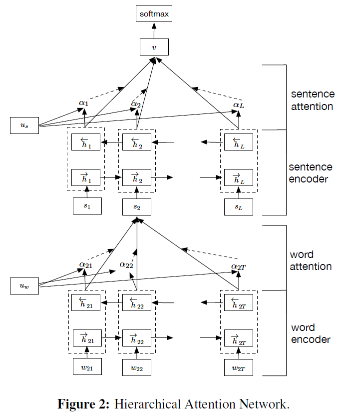

## Attention Mechanism

## Language Modeling-Word, Sentence, Document Representation

### 4-NAACL16-CMU-Hierarchical Attention Networks for Document Classification
  [PDF](http://aclweb.org/anthology/N/N16/N16-1174.pdf),
  [Bib](http://aclweb.org/anthology/N/N16/N16-1174.bib)

  - [**Goal**] Hierarchical Attention Networks for Document Classification
  - [**Problem**]
      - a). Sentiment Estimation
          - Data Set: Yelp reviews, IMDB reviews, Amazon reviews
      - b). Topic Classification
          - Data Set: Yahoo answers
  - [**Model**]
  
      
 
    - (i)  it has a hierarchical structure that mirrors the hierarchical structure of documents; 
    - (ii) it has two levels of attention mechanisms applied at the word and sentence-level, enabling it to attend 
    differentially to more and less important content when constructing the document representation
    - The context vector u_w can be seen as a high level representation of a fixed query “what is the informative word” 
    over the words like that used in memory networks (Sukhbaatar et al., 2015; Kumar et al., 2015).
  - [**Remark**]
    - **Modification of Model**: Hierarchical + Attention

## Sequence-to-sequence Model

### 7-NAACL16-Lu Wang-Neural Network-Based Abstract Generation for Opinions and Arguments
  [PDF](http://www.ccs.neu.edu/home/luwang/papers/NAACL2016.pdf),
  [Bib](http://www.ccs.neu.edu/home/luwang/papers/NAACL2016.bib)
  
  **Excellent work, clear structure, read it more times**

  - [**Problem**] Abstract generation for opinioons and arguments
  - [**Model Step-by-step**]
     - Data Collection, the dataset can be found [here](http://www.ccs.neu.edu/home/luwang): 
       - movie reviews, from www.rottentomatoes.com
       - arguments on contraoversial topics, from idebate.org
     - Step 1: **Problem Formulation**, the ... task is defined to as finding y, which is the most likely sequence of word... such that: formulation
     - Step 2: **Decoder**, LSTM model for long range dependencies.
     - Step 3: **Encoder**, Bi-LSTM + Attention, Attention is userd to know how likely the input word is to be used to generate the next word in summary.
     - Step 4: **Attention Over Multiple Inputs**: It depends on task.
     - Step 5: **Importance Estimation to sub-sampling from the input**: because there are two problems with this approach. Firstly, the model is sensitive to the order of text units (a paragraph); Secondly, time cost too much.
     - Step 6: **Post-processing**: re-rank the n-best summaries; it is directly related to the final goal.
  - [**Experiment:anwser the question from model**]
     - Question 1: How is the performance of component? -- Importance Estimation Evaluation(Step5)
     - Question 2: What is the model performance for automatic summary?
     - Question 3: What is the model performance according to human?
     - Question 4: What is the hyper-parameter K in sub-sampling effect? (Step5)
     - Question 5: Is the post-processing needed? (Step6)
   
　　This work comes from deepmind, it presented a neural approach to generate abstractive summaries for opinionated text.
Attention-based method is employed to find salient inormation from different input text generate an informative and 
concise summary. To cope with the large number of input text, an importance-based sampling mechanism is deployed for 
training.

　　This work applies the attention model to abstract generation. **I think the motivation to build this model is to 
employ attention over different input text (different task may have different question to solve, different model to 
modify, haha)**
   
　　I like this writting skills and research method, such as Bengio, deepmind.

### 14-ACL16-Stanford-A Persona-Based Neural Conversation Model
   [PDF](http://arxiv.org/pdf/1603.06155v2.pdf),
   [!Bib]()

   - [**Problem**]: Inconsistent responses via SEQ2SEQ model.
     > *message*: How old are you?  
     > *response*: 16 and you?      
     > *message*: What's your age?  
     > *response*: 18.
   - [**Model**]
     - Idea: a). Prior Knowledge, b). User Modeling 
       - This model represents each individual speaker as a vector or embedding, which encodes speaker-specific information (e.g., dialect, register, age, gender, personal information) that influences the content and style of her response. 
       - **Speaker Model**: As in standard SEQ2SEQ models, we first encode message S into a vector representation using the source LSTM. Then for each step in the target side, hidden units are obtained by combining the represeantation produced by the target LSTM at the previous time step, the word representations at the current time step, the speaker embedding.
       - **Speaker-Addressee Model**: replace speaker embedding with an interactive representation by combining two speaker embedding.
   - [**Remark**]
     - It is a natural idea to embed our common knowledge or our prior knowledge with a user specific vector representaion and update it throughout the generation process, as human learns from current conversation.
     - **But what do we learn from our daily conversation?**
       - knowledge? thinking is more likely to get it.
       - strength our memory? maybe.
       - interactive? Interaction between two users' knowledge representaion. **How to model?** 

### 15-ACL16-Percy Liang-How Much is 131 Million Dollars Putting Numbers in Perspective with Compositional Descriptions
  [PDF](http://nlp.stanford.edu/pubs/chaganty2016perspectives.pdf),
  [!Bib](~)

  **How to propose a new task?**
    **i). Introduction: tell us the Situation, Conflict, Question** 
    **ii). Problem statement**
    **iii). Dataset construction**
    **IV). Model**
    **V). Evaluation and Results**
  
  **This work shows how to use crowdworkers to complete a new task. The author is more like a leader of the concert, guide others to complete the fussy task.**

  - [**Problem**]: How much is 131 million Dollars? About the cost to employ every one in Texas over a lunch period
  - [**Model**]: it consists two steps: formula construction and description generation. 
    - I). In construction, it composes formulae from numeric facts in a knowledge base and rank the resulting formulas based on familiarity, numeric proximity and semantic compatibility. 
    - II). In generation, we convert a formula into natural language using a sequence-to-sequence recurrent neural network.
  - [**Data set**]: I). Collecting the knowledge base. II). Collectiong numetic mentions. III). Generating formulas. IV). Collectiong descriptions of formulas. V). Collecting data on formula preference.
  - [**Remark**]: How to present number is still a question to answer in NLP. This paper does not directly solve the question, but proposes a new task for how to describe the specific number. Firstly, it constructs some formula. Secondly, it ranks these formulas. Lastly, with sequence-to-sequence model, it transforms the formula to natural language process.

### 16-ICLR16-facebook-SEQUENCE LEVEL TRAINING WITH RECURRENT NEURAL NETWORKS
  [PDF](http://arxiv.org/abs/1511.06732),
  [!Bib](),
  [Torch](https://github.com/facebookresearch/MIXER)
  
  - [**Problem**]: The common approach to solving sequence generation problems is to train the RNN to convert some fixed-size representation of the input into the output sequence, optimizing cross-entropy loss. **There are two main issues with this approach.**
    -  **cross-entropy is not what the final model is evaluated on**
    -  **during training, the RNN is fed as input the ground-truth**   
  - [**Problem-Experiment**]: text summary, machine translation, and image captioning
  - [**Model**]
      - REINFORCE algorithm for back-propagation on computational graphs that output a probability distribution on actions. 
      The base idea is, for each example, if the RNN produces a sequence that yields a reward that is better than average, then push the probability distribution to favor what it decided, and vice-versa - if the reward was worse than average, push the distribution to favor less what it had decided.
      - feed the output of the RNN into itself during training. 
      However, the way this is done is by actually taking the k most-likely outputs from the previous step and passing a weighted combination of them as input to the next.  The authors motivate this by referring beam search, a method used by others to find a most-likely sequence by expanding out most likely possibilities at each token of the sequence.
  - [**Remark**]: I am still not clear yet, I wil read it again. Questions: i). cross-entropy is also not final STS evaluated on, what I should do? ii). Do these two issues happen in STS task? III). What is the problems of the NN models in STS.

### 21-NAACL16-Ke Tran-Recurrent Memory Networks for Language Modeling
  [PDF](http://aclweb.org/anthology/N/N16/N16-1036.pdf),
  [Bib](http://aclweb.org/anthology/N/N16/N16-1036.bib),
  [Th](https://github.com/ketranm/RMN)
  
  **Recurrent Networks + Memory Networks**
  
  >**A graphical illustration of an unfolded RMR with memory size 4. Dashed line indicates concatenation. The MB takes the output of the bottom LSTM layer and the 4-word history as its input. The output of the MB is then passed to the second LSTM layer on top. There is no direct connection between MBs of different time steps. The last LSTM layer carries the MB’s outputs recurrently.**

  - [**Motivation**]
    The Memory Block (MB) takes the hidden state of the LSTM and compares it to the most recent inputs using an attention mechanism. Thus, analyzing the attention weights of a trained model can give us valuable insight into the information that is retained over time in LSTM. 
  - [**Experiments**]
    - **Language Model Experiments**
      - Perplexities
      > In natural language processing, perplexity is a way of evaluating language models. A language model is a probability distribution over entire sentences or texts.
      >
      > Using the definition of perplexity for a probability model, one might find, for example, that the average sentence xi in the test sample could be coded in 190 bits (i.e., the test sentences had an average log-probability of -190). This would give an enormous model perplexity of 2190 per sentence. However, it is more common to normalize for sentence length and consider only the number of bits per word. Thus, if the test sample's sentences comprised a total of 1,000 words, and could be coded using a total of 7.95 bits per word, one could report a model perplexity of 27.95 = 247 per word. In other words, the model is as confused on test data as if it had to choose uniformly and independently among 247 possibilities for each word.
    - **Attention Analysis & Syntactic Analysis**
      - Positional and lexical analysis
      - Syntactic analysis
    - **Sentence Completion Challenge**    
      - The Microsoft Research Sentence Completion Challenge (Zweig and Burges, 2012)
      - example: The stage lost a fine , even as science lost an acute reasoner , when he became a specialist in crime  
        a) linguist b) hunter **c) actor** d) estate e) horseman
 
