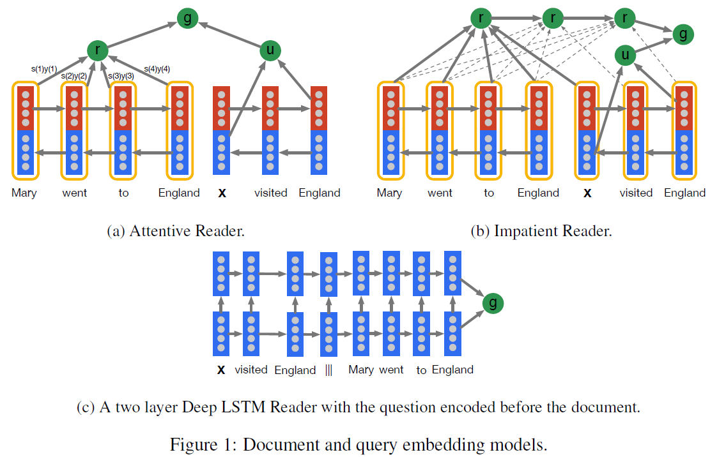
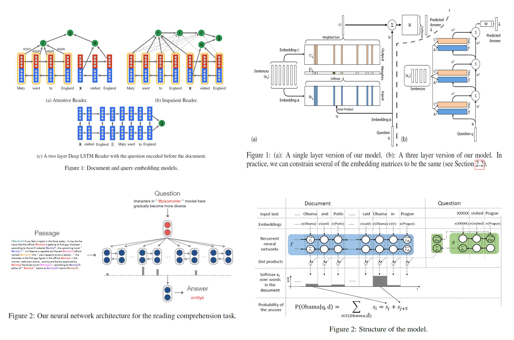
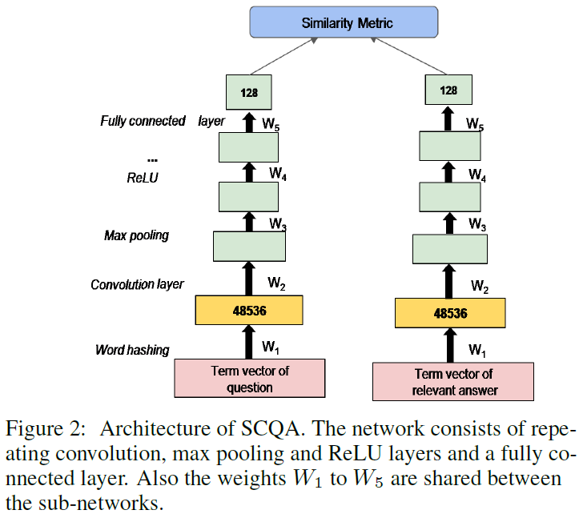
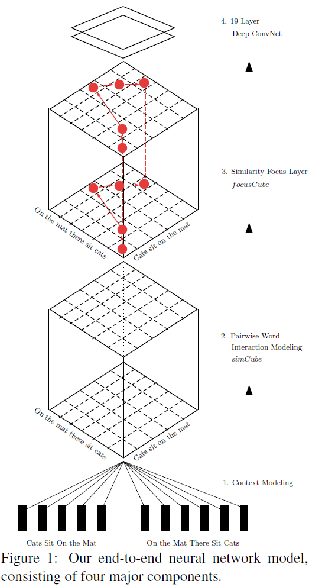
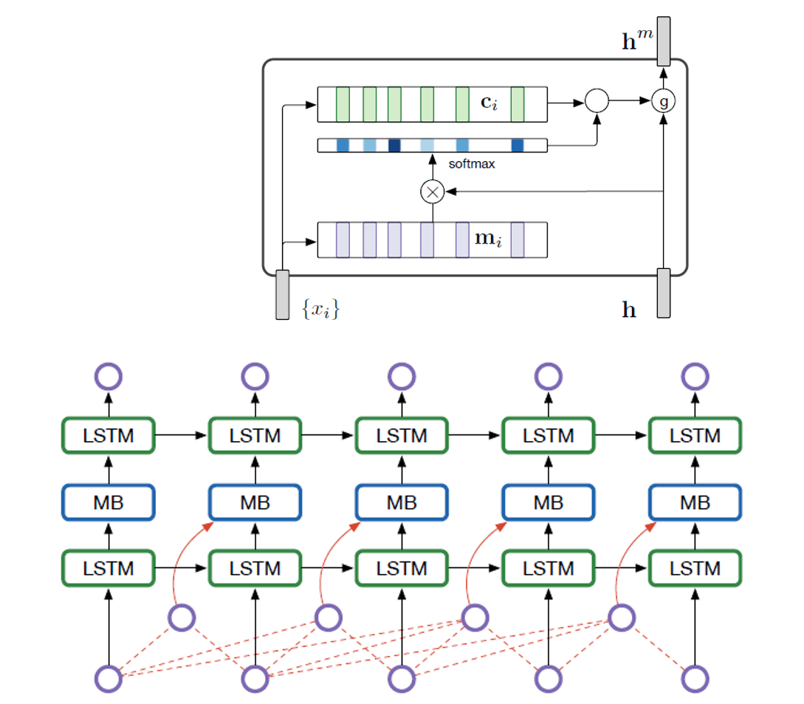

# Summer\_Paper\_Reading_2016
eg: 0-ACL16-Ng-Paper_title.pdf

- Abstract
  - Overview:
  - Advantage:
  - Disadvantage:
  - What can I do? / Can I employ its idea?
- Experiments
  - DataSet:
  - Toolkit:
  - Baseline:
  - Result:

[TOC]

### 1-NIPS15-Google-Pointer Network
  [PDF](http://papers.nips.cc/paper/5866-pointer-networks.pdf), 
  [Bib](https://papers.nips.cc/paper/5866-pointer-networks/bibtex)

  - [**Problem-Paper**] the number of target classes depends on the length of input, which is variable.
  - [**Problem-Experiment**] 
  	- finding planar convex hulls
  	- computing Delaunary triangulations
  	- the planar Travelling Salesman Problem
  - [**Model**] instead of using attention to blend hidden units of an encoder to a context vector of a decoder, it
  uses attention as a pointer to select a member of the input sequence as the output.
  - [**Remark**] 
  	- Neural attention model deals with the fundamental problem representing variable length dictionaries, appling to 
  	three distinct algorithmic problems.
	- Idea is fantastic.

　　Authors of this paper propose an attention model based on "Neural machine translation by jointly learning to align 
and translate"[1] by using LSTMs. Their model decides what to predict by using the output of a softmax MLP over the inputs 
as opposed to regular attention model used in [1]\(RNNSearch\), where they used that to use for the convex combination 
of the input annotations to predict where to attend to translate in the target language. 
The output of the softmax-MLP predicts the location of the output at each timestep directly from the input sequence. 

　　The advantage of this approach is that, the output softmax dictionary only depends on the length of the input 
sequence instead of on the number of possible instances in the problem. 
The authors have provided very interesting experimental results on three different discrete optimization problems.

### 2-ACL16-IBM-Addressing Limited Data for Textual Entailment Across Domains
  [PDF](https://arxiv.org/pdf/1606.02638v1.pdf),
  [!Bib](~)
	  	
  - [**Problem-Paper**] exploit unlabled data to improve F-score for TE task. 
  - [**Problem-Experiment**] find all sentences in a corpus that entail a given hypothsis. 
  Domain: Newswire (RTE-5,6,7) & Clinical (self construct)
  - [**Model**] Tradition Features + self-training/activate learning
  - [**Conclusion**] The author analysis the possible explanation for the improvement:
  Class Distribution. down-sampling and up-sampling is not useful. 
  Activate learning will sampling positive examples, thus it can match the performance with fewer examples. 
  - [**Remark**] Experiment is beautiful and convising, Information Retrival Method.

　　This paper illustrates that how self-training will influence the classification and why active learning 
will reduce the examples to only 6 percent.   
　　The author experiments on two domains -- newswire and clinical. First, the author creates an entailment dataset 
for clinical domain with human annoted. Second, he builds a highly competitive supervised system, called ENT. Last, he
explore two strategies - self-training and active learning to address the lack of labled data. Experiment is done in 
detail and convincing.

### 3-ACL16-Stanford-A Thorough Examination of the CNN/Daily Mail Reading Comprehension Task
  [PDF](https://arxiv.org/abs/1606.02858),
  [!Bib](~),
  [!Github](https://github.com/danqi/rc-cnn-dailymail)

  - [**Problem**] CNN/Daily Mail Reading Comprehension Task
  - [**Model**] 
  	- Traditional Features
  	  - Feature ablation analysis  
  	- Attention Neural Network(followed 5-NIPS15-NYU-End-To-End Memory Networks)
  - [**Related Dataset**]
    - CNN/Daily Mail (2015)
    - MCTest（2013）
    - Children Book Test （2016）
    - bAbI （2016）
  - [**Data Analysis**] breakdown of the Examples, Analysis the perfomance on each categories(although on small dataset).
  - [**Remark**] Also we can construct traditional ML and NN, **data analysis is important**, without this, Experiment
  seems to be inconvincing.

　　This paper conducts a thorougn examination of CNN/Daily Mail Reading Comprehension Task, which origin from the idea 
that a bullet point usually summaries one or several aspects of the article. **If the computer understands the content
of the artticle. It should be able to infer the missing entity in the bullet point.**

　　two supervised systems are implemented -- a conventional entity centric classfier and an end to end neural network.
Expriment shows that the straight-forward NLP system, compared with origin frame-semantic parser[^1], obtain accuracies
of 72.4% and 75.8％ on these two datasetｓ.

　　Besides, the author **extracts 100 examples to analysis the results**. She roughly classify the examples into 6 categories, 
i.e., Exact Match, Paraphrase, Parial clue, Multiple sent, (Coref.Error, Hard), the last two is hard for human to obtain
the correct answer.

[^1]: Teaching Machine to read and comprehend, NIPS15, Hermann et.al

### 4-NAACL16-CMU-Hierarchical Attention Networks for Document Classification
  [PDF](http://aclweb.org/anthology/N/N16/N16-1174.pdf),
  [Bib](http://aclweb.org/anthology/N/N16/N16-1174.bib)

  - [**Goal**] Hierarchical Attention Networks for Document Classification
  - [**Problem**]
  	- a). Sentiment Estimation
	  	- Data Set: Yelp reviews, IMDB reviews, Amazon reviews
  	- b). Topic Classification
  		- Data Set: Yahoo answers
  - [**Model**]
  
  	
 
    - (i)  it has a hierarchical structure that mirrors the hierarchical structure of documents; 
    - (ii) it has two levels of attention mechanisms applied at the word and sentence-level, enabling it to attend 
    differentially to more and less important content when constructing the document representation
    - The context vector u_w can be seen as a high level representation of a fixed query “what is the informative word” 
    over the words like that used in memory networks (Sukhbaatar et al., 2015; Kumar et al., 2015).
  - [**Remark**]
    - **Modification of Model**: Hierarchical + Attention

### 5-NIPS15-NYU-End-To-End Memory Networks
  [PDF](http://papers.nips.cc/paper/5846-end-to-end-memory-networks), 
  [Bib](http://papers.nips.cc/paper/5846-end-to-end-memory-networks/bibtex),
  [Theano](https://github.com/npow/MemN2N),
  [Tensorflow](https://github.com/seominjoon/memnn-tensorflow)
  
  - [**Goal**] introdce a **neural network** with a **recurrent attention** over a possibly large **external memory**. 
  - [**Problem-Experiment**] 
    - a). synthetic question answering (Reading Comprehension Task)
    - b). Language Model
  - [**Dataset**]
    - a).bAbI
    - b).Penn Tree Bank & Text8
  - [**Model**]  
    **Notation**:
	- input: sentences: $$x_1, x_2, \ldot, x_i$$, question: q
	- output: answer:a
	- Variable: A, B, C, W
	- $$ shape(x_i) = d; shape(A) = (d, V); shape(m_i) = d; shape(input) = (len(sentences), d) $$
      
    - Sentence Representation: BoW & **Position Encoding** (slightly different from BoW, add position information), 
      $$ m_i = \sum_{j}Ax_{ij} $$  
    - Temporal Encoding: QA tasks require some notion of temporal context, $$ m_i = \sum_{j}Ax_{ij} + T_{A}(i)$$ 
    - Random Noise: to reqularize T_A, randomly add 10% of empty memories to the stories.
    - The capacity of memory is restricted to the most recent 50 sentences.
    - **Since the number of sentences and the number of words per sentence varied between problems, a null symbol(all 
    zero) was used to pad them all to a fixed size**
  - [**Remarks**]
    - **How to write a new Model with not the state-of-art performance**?
      - incuction previous model to this model (LSTM, Attention, ...)
      - Compare with other related model (where is the difference?)
      - How can the model changes?
      - What can the model apply?
    - **Related Works** deserves to be learned. 
    - **Code** deserves to be implenment by myself.
   
　　This Paper introduce a neural nerwork with a recurrent attention model over a possibly large external memory.

　　**The memory in RNNs model is the state of the network, which is latent and inherently unstable over long timescales. 
The LSTM-based Model address this through local memory cells which lock in the network from the past. This model differs
from these in that it uses a global memory, with shared read and write functions.**    
    
　　This model also related to attention mechanism in Banhadnau's work[^1], although Banhadnau's work[^1] is only over a
single sentence rather than many.

　　This approach is compettive with Memory Networks, but with less supervision.

Next is quoted from yanranli's blog. The summary deserves me to leaned. you can refer to [here](http://yanran.li/peppypapers/2016/01/09/nips-2015-deep-learning-symposium-part-ii.html) for
more details. 
   > And the authors attempt several ways in this paper to fulfill their goal. 
   > First, the single-layer or multi-layer, and then the transformation of feature space. 
   > If one separate the output of the end-to-end memory networks, they can be parallized with typical RNN. 
   > The output comprises of two parts, internal ouptut and external output, 
   > which can be parallized to RNN’s memory and predicted label, respectively.

[^1]: Neural machine translation by jointly learning to align and translate. ICLR15, Bahdanau, Cho, and Bengio

### 6-NAACL16-Sultan-Bayesian Supervised Domain Adaptation for Short Text Similarity
  [PDF](http://www.aclweb.org/anthology/N/N16/N16-1107.pdf), 
  [Bib](http://www.aclweb.org/anthology/N/N16/N16-1107.bib)

  - [**Problem**] Domain Adaptation for Short Text Similarity
  - [**Model**]  A two-level hierachical Bayesian model -- Each $w_d$ depends not on its domain-specific observations
  (first level) but also on information derived from the global, shared parameter $w*$ (second level). And the 
  hierarchical structure (1) jointly learns global, task-level and domain-level feature weights, (2) retaining the 
  distinction between in-domain and out-of-domain annotations.
  - [**Features**]
    - monolingual word aligner
    - cosine similarity from 400-dimensional embedding(Baroni et.al, 2014)
  - [**Experiment**]
    - a). Short Text Similarity(STS), 10 domains
    - b). Short Answer Scoring(SAS), Dataset: Mohler et al., 2011
    - c). Answer Sentence Ranking(ASR), Dataset: Wang et al., 2007, TREC8-13
  - [**Remarks**]
    - 	Although this is traditional feature method, and the results is not inspiring, the author construt **amount of 
    Analysis** to show the advantage of the system and answer why it does not perform well(**because of the data, smile**). 

	
### 7-NAACL16-Lu Wang-Neural Network-Based Abstract Generation for Opinions and Arguments
  [PDF](http://www.ccs.neu.edu/home/luwang/papers/NAACL2016.pdf),
  [Bib](http://www.ccs.neu.edu/home/luwang/papers/NAACL2016.bib)
  
  **Excellent work, clear structure, read it more times**

  - [**Problem**] Abstract generation for opinioons and arguments
  - [**Model Step-by-step**]
     - Data Collection, the dataset can be found [here](http://www.ccs.neu.edu/home/luwang): 
       - movie reviews, from www.rottentomatoes.com
       - arguments on contraoversial topics, from idebate.org
     - Step 1: **Problem Formulation**, the ... task is defined to as finding y, which is the most likely sequence of word... such that: formulation
     - Step 2: **Decoder**, LSTM model for long range dependencies.
     - Step 3: **Encoder**, Bi-LSTM + Attention, Attention is userd to know how likely the input word is to be used to generate the next word in summary.
     - Step 4: **Attention Over Multiple Inputs**: It depends on task.
     - Step 5: **Importance Estimation to sub-sampling from the input**: because there are two problems with this approach. Firstly, the model is sensitive to the order of text units (a paragraph); Secondly, time cost too much.
     - Step 6: **Post-processing**: re-rank the n-best summaries; it is directly related to the final goal.
  - [**Experiment:anwser the question from model**]
     - Question 1: How is the performance of component? -- Importance Estimation Evaluation(Step5)
     - Question 2: What is the model performance for automatic summary?
     - Question 3: What is the model performance according to human?
     - Question 4: What is the hyper-parameter K in sub-sampling effect? (Step5)
     - Question 5: Is the post-processing needed? (Step6)
   
　　This work comes from deepmind, it presented a neural approach to generate abstractive summaries for opinionated text.
Attention-based method is employed to find salient inormation from different input text generate an informative and 
concise summary. To cope with the large number of input text, an importance-based sampling mechanism is deployed for 
training.

　　This work applies the attention model to abstract generation. **I think the motivation to build this model is to 
employ attention over different input text (different task may have different question to solve, different model to 
modify, haha)**
   
　　I like this writting skills and research method, such as Bengio, deepmind.

### 8-NIPS15-DeepMind-Teaching Machines to Read and Comprehend
  [PDF](https://papers.nips.cc/paper/5945-teaching-machines-to-read-and-comprehend),
  [Bib](https://papers.nips.cc/paper/5945-teaching-machines-to-read-and-comprehend/bibtex),
  [Tensorflow](https://github.com/carpedm20/attentive-reader-tensorflow)
   
  **What is the guide paper, which will be reseach hot in the future?**

  - [**Problem**]: Large scale training and test datasets have been missing for Reading Comprehension Task (Document, 
  Question) - (Answer).
  - [**Data Collection**]: Summary and paraphrase sentences, with their assosiated documents, can be readily converted 
  to context-query-answer triples using simple entity detection and anonymisation algorithms.
  - [**Models**]
  	- Traditional Methods(Benchmark): Symbolic Matching Models.
  	- Neural Network Models
  	   
      - g(d, q) returns a vector embedding of a document and question pair
      - **The Attentive Reader can be viewed as a generalisation of the application of Memory Networks**, Memory Networks
      employs an attention mechanism at the sentence level, while this at the tokens level but with entire future and past
      context.
      - **Impatient Reader emphasizes on the reread mechanism.** Motivated from " We expect to comprehend deeplier as we 
      reread once more "

      >  Impatient Reader. This model is really interesting and intuitive, which emphasizes on the reread mechanism. 
      >  That is to say, for each token in each query, a whole document is read once through. One token, one document. 
      >  Next token, again this document. That’s what the reread is. I interpret such reread mechanism as a gradual 
      >  comprehension procedure. When a human being is reading a tough article, s/he will read again and again. 
      >  We expect to comprehend deeplier as we reread once more. Such motivation, behind this reread mechanism, if any, 
      >  will make larger impact when predicting beyond a token level output. Therefore, I think this mechanism is 
      >  worthy of implementing in more tasks.
  
  - [**Experiments**]
    - How difficult is this task? Traditional excellet model, **Danqi Chen [^1] achieve great results with Features**
    - Traditional Methods versus Neural Models?
    - Which component contributes to the end performance?

[^1] 3-ACL16-Stanford-A Thorough Examination of the CNN/Daily Mail Reading Comprehension Task

### 9-AAAI16-Mueller-Siamese Recurrent Architectures for Learning Sentence Similarity
  [PDF](http://www.mit.edu/~jonasm/info/MuellerThyagarajan_AAAI16.pdf),
  Bib
 
  **A new top resluts for Relateness on SICK: 0.8822(pearson)**
  
  - [**Model**]
    - replace the top softmax layer with l1 norm similarity function
    - Sentence Representation can capature the following information:
      - negation, not, no
      - topic
      - Entailment classsification 
    - I think the model is to enforcement the similarity of the two sentences, which is direct and efficient.
  - [**Experiments TODO**]
    - replace the top layer
    - learn how to fine-grain the network.
    - Read this paper again.
    - Read the latest related paper from reference.

### 10-NIPS15-Ryan-Skip-Thought Vectors
  [PDF](http://papers.nips.cc/paper/5950-skip-thought-vectors),
  [Bib](http://papers.nips.cc/paper/5950-skip-thought-vectors/bibtex),
  [Review](http://media.nips.cc/nipsbooks/nipspapers/paper_files/nips28/reviews/1826.html)
  [Theono](https://github.com/ryankiros/skip-thoughts)

  **This paper presented an encoder-decoder model to learn a generic, distributed sentence encoder.**
  
  - [**Problem**]: Sentence Representation. Sentence vectors ate extracted and evaluated with linear models on 8 tasks. 
  - [**Motivation**]: 
    > In this paper we abstract away from the composition methods themselves and consider an alternative loss function
    > that can be applied with any composition operator. **(step1 purpose: what we want to do?)** 
    > 
    > We consider the following question: is there a task and a corresponding loss that will allow us to learn highly 
    > generic sentence representations?  **(step2 question: The key problem?)** 
	>
	> We give evidence for this by proposing a model for learning high-quality sentence vectors without a particular
	> supervised task in mind. **(step3 plan1: solution we reject)** 
	> 
	> Using word vector learning as inspiration, we propose an objective function that abstracts the skip-gram model to 
	> the sentence level. That is, instead of using a word to predict its surrounding context, we instead encode a sentence
	> to predict the sentences around it. Thus, any composition operator can be substituted as a sentence encoder and 
	> only the objective function becomes modified.  **(step4 our work: step by step, more and more deep)** 
	> 
	> Figure 1 illustrate the model. We call our model **skip-thoughts** and vectors induced by our model are called
	> **skip-thought vectors**. **(step5 Others: Figure or Name)** 

    

### 11-EMNLP15-Hua He-Multi-Perspective Sentence Similarity Modeling with Convolutional Neural Networks
  [PDF](http://aclweb.org/anthology/D/D15/D15-1181.pdf),
  [Bib](http://aclweb.org/anthology/D/D15/D15-1181.bib)

  **Multi-Perspective: 1). Multiple granularities 2). Window size 3). Multiple types of pooling 4). Similarity Measurement: Multiple distance functions**
  
  - [**Remarks**]:
    - This model tries to explore multi-perspective method on CNNs, so how to combine the local component I think is the key problem in the experiment, and the author proposed **building block** as a set of groups, which make the whole process clear and efficient.
  - [**Experiments TODO**]   
    - treat each **Perspective** as **Component** implemented in CNNs.
    - analysis different combination's efficient
    - add the thought of **Semantic Similarity** into the **Model**.

### 12-NIPS13-Mikolov-Distributed Representations ofWords and Phrases and their Compositionality跳转到的地方
  [PDF](http://arxiv.org/pdf/1310.4546v1.pdf),
  Bib

  [ICLR13-Mikolov-Efficient estimation of word representations in vector space](https://arxiv.org/pdf/1301.3781.pdf),
  Bib

  - [**Problem**] the cost of computing the gradient of the Skip-gram model is proportion to the vocabulary size.
  - [**Method**]
   - **Hierachical Softmax**
     - Build a binary Huffman tree as the representation of the output layer with W words as its leaves, and for each non-leaves, explicitly represents the relative probabilities of its chiald nodes.
     - reduce to log(W) 
   - **Negative Sampling**  
     - Assumption: **A good model should be able to differentiate data  from noise by means of logistic regression**.
     - replace the objective of nagative sampling, to distingush the target word from draws from the noise distrubution 
  - [**Others**]
    - **SubSampling of Frequent Words**
      - the most frequent words usually provide less information value than the rare words.
      - discarded with a probability
    - **Phrases Vector**
      - replace words to phrases
      - how to extract phrases? -- words that appear frequently together, and infrequently in other contexts.

　　This two paper proposed the skip-gram model, and tries to solve two aspects problems: 1). How to make it computable? 2). How to make it more semantical? 

　　As to the first problem, the author tries two method, the one is to replace the softmax as hierachical softmax, which reduce the time complexity to log(W), and the other is to replace the objective with negative sampling. 

　　And when it comes to the second problem, the author tries some tricks. Firstly, he subsampling the frequent words since the vector representations of frequent words do not change significantly. Secondly, he treat phrases as a kind of word to train phrase vectoe, because many phrases have a meaning that is not a simple composition of the meaning of the its individual words.

　　**How to build a model? I think this papers pointed out the right directions.**

### 13-ACL16-Yandex-Siamese CBOW: OptimizingWord Embeddings for Sentence Representations
  [PDF](https://arxiv.org/abs/1606.04640),
  Bib,
  [Theono](https://bitbucket.org/TomKenter/siamese-cbow)
  
  **Siamese CBOW trains word embedding directly for the purpose of being averaged to produce better sentence representation.**
  
  **Still, a question need to be answered -- How to select negative samples? random? according to similarity? refer to the code! (Update: Both in word2vec[line 442-446] & Siamese CBOW[line 432-448], random slect negative samples!)**
 
  - [**Model**]
    - Constructing a supervised training criterion by having our network predict sentences occuring next to each other in the training data, which is similar to **Skip-thought**. 
  - [**Related Work**]
    - Word2vec
    - Skip-thought  
  - [**Training Set**]
    - Toronto Book Corpus: 74,004,228 setences; 1,057,070,918 tokens, originating from 7087 unique books.
    - consider tokens appearing 5 times or more, which leads to a vocabulary of 315,643 words.
    - http://www.cs.toronto.edu/~mbweb 
  - [**TODO**]
    - **replace word2vec in STS with this model**
 
### 14-ACL16-Stanford-A Persona-Based Neural Conversation Model
   [PDF](http://arxiv.org/pdf/1603.06155v2.pdf),
   [!Bib]()

   - [**Problem**]: Inconsistent responses via SEQ2SEQ model.
     > *message*: How old are you?  
     > *response*: 16 and you?      
     > *message*: What's your age?  
     > *response*: 18.
   - [**Model**]
     - Idea: a). Prior Knowledge, b). User Modeling 
       - This model represents each individual speaker as a vector or embedding, which encodes speaker-specific information (e.g., dialect, register, age, gender, personal information) that influences the content and style of her response. 
       - **Speaker Model**: As in standard SEQ2SEQ models, we first encode message S into a vector representation using the source LSTM. Then for each step in the target side, hidden units are obtained by combining the represeantation produced by the target LSTM at the previous time step, the word representations at the current time step, the speaker embedding.
       - **Speaker-Addressee Model**: replace speaker embedding with an interactive representation by combining two speaker embedding.
   - [**Remark**]
     - It is a natural idea to embed our common knowledge or our prior knowledge with a user specific vector representaion and update it throughout the generation process, as human learns from current conversation.
     - **But what do we learn from our daily conversation?**
       - knowledge? thinking is more likely to get it.
       - strength our memory? maybe.
       - interactive? Interaction between two users' knowledge representaion. **How to model?** 

### 15-ACL16-Percy Liang-How Much is 131 Million Dollars Putting Numbers in Perspective with Compositional Descriptions
  [PDF](http://nlp.stanford.edu/pubs/chaganty2016perspectives.pdf),
  [!Bib](~)

  **How to propose a new task?**
    **i). Introduction: tell us the Situation, Conflict, Question** 
    **ii). Problem statement**
    **iii). Dataset construction**
    **IV). Model**
    **V). Evaluation and Results**
  
  **This work shows how to use crowdworkers to complete a new task. The author is more like a leader of the concert, guide others to complete the fussy task.**

  - [**Problem**]: How much is 131 million Dollars? About the cost to employ every one in Texas over a lunch period
  - [**Model**]: it consists two steps: formula construction and description generation. 
    - I). In construction, it composes formulae from numeric facts in a knowledge base and rank the resulting formulas based on familiarity, numeric proximity and semantic compatibility. 
    - II). In generation, we convert a formula into natural language using a sequence-to-sequence recurrent neural network.
  - [**Data set**]: I). Collecting the knowledge base. II). Collectiong numetic mentions. III). Generating formulas. IV). Collectiong descriptions of formulas. V). Collecting data on formula preference.
  - [**Remark**]: How to present number is still a question to answer in NLP. This paper does not directly solve the question, but proposes a new task for how to describe the specific number. Firstly, it constructs some formula. Secondly, it ranks these formulas. Lastly, with sequence-to-sequence model, it transforms the formula to natural language process.

### 16-ICLR16-facebook-SEQUENCE LEVEL TRAINING WITH RECURRENT NEURAL NETWORKS
  [PDF](http://arxiv.org/abs/1511.06732),
  [!Bib](),
  [Torch](https://github.com/facebookresearch/MIXER)
  
  - [**Problem**]: The common approach to solving sequence generation problems is to train the RNN to convert some fixed-size representation of the input into the output sequence, optimizing cross-entropy loss. **There are two main issues with this approach.**
    -  **cross-entropy is not what the final model is evaluated on**
    -  **during training, the RNN is fed as input the ground-truth**   
  - [**Problem-Experiment**]: text summary, machine translation, and image captioning
  - [**Model**]
  	- REINFORCE algorithm for back-propagation on computational graphs that output a probability distribution on actions. 
  	The base idea is, for each example, if the RNN produces a sequence that yields a reward that is better than average, then push the probability distribution to favor what it decided, and vice-versa - if the reward was worse than average, push the distribution to favor less what it had decided.
  	- feed the output of the RNN into itself during training. 
  	However, the way this is done is by actually taking the k most-likely outputs from the previous step and passing a weighted combination of them as input to the next.  The authors motivate this by referring beam search, a method used by others to find a most-likely sequence by expanding out most likely possibilities at each token of the sequence.
  - [**Remark**]: I am still not clear yet, I wil read it again. Questions: i). cross-entropy is also not final STS evaluated on, what I should do? ii). Do these two issues happen in STS task? III). What is the problems of the NN models in STS.

### 17-ACL16-Kadlec-Text Understanding with the Attention Sum Reader Network
  [PDF](http://aclweb.org/anthology/P/P16/P16-1086.pdf)
  [Bib](http://aclweb.org/anthology/P/P16/P16-1086.bib)

#### Summary of Reading Comprehension task

- [Attentive Reader & Impatient Reader](8-NIPS15-DeepMind-Teaching Machines to Read and Comprehend)
- [MemNNs](5-NIPS15-  NYU-End-To-End Memory Networks)
- [Chen et al.(2016)](3-ACL16-Stanford-A Thorough Examination of the CNN/Daily Mail Reading Comprehension Task)
- [AS Reader](17-ACL16-Kadlec-Text Understanding with the Attention Sum Reader Network)

  - [**Model**]: This model Attnetion Sum Reader(AS Reader) is tail-made to leverage the fact that the answeris a word from the context document. This is a double-edged sword. While it achives state-of-the-art results on all of the mentioned datasets (where this assumption holds true), it cannot produce an answer which is not contained in the document.
  
  This model is inspired by Ptr-Nets ([1-NIPS15-Google-Pointer Network]()) in using an attention mechanism to select the answer in the context rather than blend words from the context into an answer representation.

  - [**Remarks**] state-of-the-art model, ensemble(different hyperparameter)
  

### 18-ACL16-PKU-Compressing Neural Language Models by Sparse Word Representations
  [PDF](http://www.aclweb.org/anthology/P/P16/P16-1022.pdf),
  [Bib](http://www.aclweb.org/anthology/P/P16/P16-1022.bib),
  [keras](https://github.com/chenych11/lm)

  
  - [**Problem**]: a). Memory-consuming b).neural LMs are unlikely to learn meaningful representations
  - [**Motivation**]: In a dictionary, an unfamiliar word is typically defined by common words.
  - [**Model**]:
    - To learn the sparse codes, "true" embeddings by SkipGram for both common words and rare words. However, these true embeddings are slacked during our language modeling.
    - Parameter Compression for Embedding Subnet
    - Parameter Compression for Prediction Subnet -- share the same set of sparse codes to represent word vectoes in Embedding and the output weights in the Prediction Subnet(this is an assumption).
    - Noise-Contrastive Estimation with ZRegression(not useful)
  - [**Experiments**]:
    - Dataset
    - Qualitative Analysis
    - Quantitative Analysis (Setting and Performance)
    - Effect of some component
  - [**Remark**]: 
    - This paper is a traditional writting skills, INTRODUCTION(Question, Motivation, Contribution). BACKGROUND. MODEL(several parts). EXPERIMENTS(This part is well written). CONCLUSION.
    - ^1 is another Sparse Word Vector Representations. It solve an optimization problem to obtain the sparse vector of words as well as a dictionary matrix simulataneously.

  ^1. 18-ACL15-CMU-Sparse Overcomplete Word Vector Representations

### 19-ACL16-IIIT-Together We Stand: Siamese Networks for Similar Question Retrieval
  [PDF](http://www.aclweb.org/anthology/P/P16/P16-1036.pdf),
  [Bib](http://www.aclweb.org/anthology/P/P16/P16-1036.bib)
  
  

  - [**Problem**]: Similar Question Retrieval, "lexico-syntactic gap"
  - [**Model**]: **Siamese Convolutional Neural Network for cQA (SCQA) learns th similarity metric for question-question pairs by leveraging the question-answer pairs available in cQA forum archives.** The idea is to project similar question pairs nearer to each other and dissimilar question pairs farther away from each other in the semantic space.(**Similar to TRANs in Reconmmendation System**).   
    However, questions pairs is not availabble, so this paper leverages existing question-anwer pairs. Input is word hashing, which is character level representation of documents that takes care of out-of-vocabulary(OOV)words and with minor spelling errors.   
    The SCQA is used to get question-question pair score, in addition, BM25 metrics was added into with weight  \alpha to improve the retrive performance.
  -  [**Experiments**]
    - Quantitative Analysis: Sevaral model compares.
    - Qualitative Analysis: Compare with each two model to analysis the effect of the model
  - [**Remark**]
    - The idea and model is simple, but the result is good and Qualitative Analysis is very meticulous

### 20-NAACL16-Hua He-PairwiseWord Interaction Modeling with Deep Neural Networks for Semantic Similarity Measurement
   [PDF](http://aclweb.org/anthology/N/N16/N16-1108.pdf),
   [Bib](http://aclweb.org/anthology/N/N16/N16-1108.bib)
   
   [20-SemEval16-Hua He-Attention-Based Multi-Perspective Convolutional Neural Networks for Textual Similarity Measurement](http://www.aclweb.org/anthology/S/S16/S16-1170.pdf)  
   [torch](https://github.com/hohoCode/textSimilarityConvNet)

    

   - [**Model**] 
     - [**Bi-LSTMs**] for context modeling of input sentences
     - [**Pairwise word interaction**] encourage direct comparisons between word contexts across sentences
     - [**Similarity focus layer**] help identify important pairwise word interactions
     - [**19-layer ConvNet**] converts the similarity measurement problem into similarity measurement
   - [**Experiment**]
    | Model                    | train    | trial    | test(r)     | settings
	|--------------------------|----------|----------|----------|---------
	| termfreq TF-IDF #w       | 0.479906 | 0.456354 | 0.478802 | ``freq_mode='tf'``
	| termfreq BM25 #w         | 0.476338 | 0.458441 | 0.474453 | (defaults)
	| ECNU run1                |          |          | 0.8414   | STS2014 winner
	| Kiros et al. (2015)      |          |          | 0.8655   | skip-thoughts
	| Mueller et al. (2016)    |          |          | 0.8822   | MaLSTM; state-of-art
	|--------------------------|----------|----------|----------|---------
	| avg                      | 0.722639 | 0.625970 | 0.621415 | (defaults)
	|                          |±0.035858 |±0.015800 |±0.017411 |
	| DAN                      | 0.730100 | 0.648327 | 0.641699 | ``inp_e_dropout=0`` ``inp_w_dropout=1/3`` ``deep=2`` ``pact='relu'``
	|                          |±0.023870 |±0.012275 |±0.015708 |
	|--------------------------|----------|----------|----------|---------
	| rnn                      | 0.732334 | 0.684798 | 0.663615 | (defaults)
	|                          |±0.035202 |±0.016028 |±0.022356 |
	| cnn                      | 0.923268 | 0.757300 | 0.762184 | (defaults)
	|                          |±0.028907 |±0.010743 |±0.006005 |
	| rnncnn                   | 0.940838 | 0.784702 | 0.790240 | (defaults)
	|                          |±0.012955 |±0.002831 |±0.004763 |
	| attn1511                 | 0.835484 | 0.732324 | 0.722736 | (defaults)
	|                          |±0.023749 |±0.011295 |±0.009434 |
	|--------------------------|----------|----------|----------|---------
	| rnn                      | 0.946294 | 0.792281 | 0.799129 | Ubuntu transfer learning (``ptscorer=B.dot_ptscorer`` ``pdim=1`` ``inp_e_dropout=0`` ``dropout=0`` ``adapt_ubuntu=False``)
	|                          |±0.018979 |±0.009483 |±0.009060 |
	| rnn                      | 0.936499 | 0.787830 | 0.798314 | SNLI transfer learning (``dropout=0`` ``inp_e_dropout=0``)
	|                          |±0.042884 |±0.007839 |±0.007330 |
    from https://github.com/brmson/dataset-sts/tree/master/data/sts/sick2014
    
     | Model                       | Pearson’s r    | Spearman’s p    | MSE      
     |-----------------------------|----------------|-----------------|----------
     | Socher et al. (2014) DTRNN  | 0.7863         | 0.7305          | 0.3983   
	 | Socher et al. (2014) SDTRNN | 0.7886         | 0.7280          | 0.3859
	 | Lai and Hockenmaier (2014)  | 0.7993         | 0.7538          | 0.3692
	 | Jimenez et al. (2014)       | 0.8070         | 0.7489          | 0.3550
	 | Bjerva et al. (2014)        | 0.8268         | 0.7721          | 0.3224
	 | Zhao et al. (2014)          | 0.8414         | -               | -
	 | LSTM                        | 0.8477         | 0.7921          | 0.2949
	 | Bi-LSTM                     | 0.8522         | 0.7952          | 0.2850
	 | 2-layer LSTM                | 0.8411         | 0.7849          | 0.2980
	 | 2-layer Bi-LSTM             | 0.8488         | 0.7926          | 0.2893
	 | Tai et al. (2015) Const. LSTM|0.8491         | 0.7873          | 0.2852
	 | Tai et al. (2015) Dep. LSTM | 0.8676         | 0.8083          | 0.2532
	 | He et al. (2015)            | 0.8686         | 0.8047          | 0.2606
	 | He et al. (2016)            | 0.8784         | 0.8199          | 0.2329

   - [**Remark**]
     - from STS work to NAACL
     - old question, old model, new combination and high performance
     - **Since combine difference features will imporove the system performance, how to apply this strategy into Neural Networks**

### 21-NAACL16-Ke Tran-Recurrent Memory Networks for Language Modeling
  [PDF](http://aclweb.org/anthology/N/N16/N16-1036.pdf),
  [Bib](http://aclweb.org/anthology/N/N16/N16-1036.bib),
  [Th](https://github.com/ketranm/RMN)
  
  **Recurrent Networks + Memory Networks**
  
  >**A graphical illustration of an unfolded RMR with memory size 4. Dashed line indicates concatenation. The MB takes the output of the bottom LSTM layer and the 4-word history as its input. The output of the MB is then passed to the second LSTM layer on top. There is no direct connection between MBs of different time steps. The last LSTM layer carries the MB’s outputs recurrently.**

  - [**Motivation**]
    The Memory Block (MB) takes the hidden state of the LSTM and compares it to the most recent inputs using an attention mechanism. Thus, analyzing the attention weights of a trained model can give us valuable insight into the information that is retained over time in LSTM. 
  - [**Experiments**]
    - **Language Model Experiments**
    - **Attention Analysis & Syntactic Analysis**
    - **Sentence Completion Challenge**    

### 22-NAACL16-USTC-Improve ChineseWord Embeddings by Exploiting Internal Structure

### 23-NAACL16-Xiaodan Zhu-DAG-Structured Long Short-Term Memory for Semantic Compositionality

### TD1-ACL16-Microsoft-Deep Reinforcement Learning with a Natural Language Action Space
  [PDF](http://arxiv.org/pdf/1511.04636v5.pdf),
  [!Bib](~)
 

# Other Papers:

### 1-ACL16-Simple PPDB: A Paraphrase Database for Simplification
  [PDF](http://cis.upenn.edu/~ccb/publications/simple-ppdb.pdf),
  [!Bib](~)

### 2-harvard-Visual Analysis of Hidden State Dynamics in Recurrent Neural Networks
  [PDF](https://arxiv.org/abs/1606.07461),
  [code](http://lstm.seas.harvard.edu/)
  
  LSTM Visual Analysis    

## NAACL
<del> A Neural Network-Based Abstract Generation Method to Opinion Summarization

<del> Bayesian Supervised Domain Adaptation for Short Text Similarity

Clustering Paraphrases by Word Sense

Convolutional Neural Networks vs. Convolution Kernels: Feature Engineering for Question Answering

<del> DAG-structured Recurent Neural Networks for Semantic Compositionality

Deep LSTM based Feature Mapping for Query Classification

Dependency Based Embeddings for Sentence Classification Tasks

Dependency Sensitive Convolutional Neural Networks for Modeling Sentences and Documents

<del> Hierarchical Attention Networks for Document Classification

Learning Distributed Representations of Sentences from Unlabelled Data

Pairwise Word Interaction Modeling with Neural Networks for Semantic Similarity Measurement

Multi-way, Multilingual Neural Machine Translation with a Shared Attention Mechanism    
