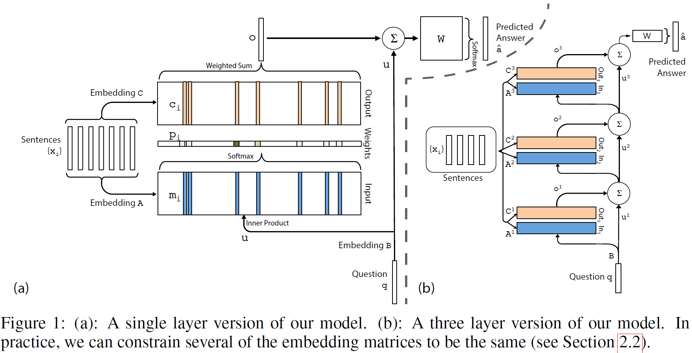

## Reading Comprehension Task

### 5-NIPS15-NYU-End-To-End Memory Networks
  [PDF](http://papers.nips.cc/paper/5846-end-to-end-memory-networks), 
  [Bib](http://papers.nips.cc/paper/5846-end-to-end-memory-networks/bibtex),
  [Theano](https://github.com/npow/MemN2N),
  [Tensorflow](https://github.com/seominjoon/memnn-tensorflow)
  
  - [**Goal**] introdce a **neural network** with a **recurrent attention** over a possibly large **external memory**. 
  - [**Problem-Experiment**] 
    - a). synthetic question answering (Reading Comprehension Task)
    - b). Language Model
  - [**Dataset**]
    - a).bAbI
    - b).Penn Tree Bank & Text8
  - [**Model**]  
    **Notation**:
    - input: sentences: $$x_1, x_2, \ldot, x_i$$, question: q
    - output: answer:a
    - Variable: A, B, C, W
    - $$ shape(x_i) = d; shape(A) = (d, V); shape(m_i) = d; shape(input) = (len(sentences), d) $$
      
    - Sentence Representation: BoW & **Position Encoding** (slightly different from BoW, add position information), 
      $$ m_i = \sum_{j}Ax_{ij} $$  
    - Temporal Encoding: QA tasks require some notion of temporal context, $$ m_i = \sum_{j}Ax_{ij} + T_{A}(i)$$ 
    - Random Noise: to reqularize T_A, randomly add 10% of empty memories to the stories.
    - The capacity of memory is restricted to the most recent 50 sentences.
    - **Since the number of sentences and the number of words per sentence varied between problems, a null symbol(all 
    zero) was used to pad them all to a fixed size**
  - [**Remarks**]
    - **How to write a new Model with not the state-of-art performance**?
      - incuction previous model to this model (LSTM, Attention, ...)
      - Compare with other related model (where is the difference?)
      - How can the model changes?
      - What can the model apply?
    - **Related Works** deserves to be learned. 
    - **Code** deserves to be implenment by myself.
   
　　This Paper introduce a neural nerwork with a recurrent attention model over a possibly large external memory.

　　**The memory in RNNs model is the state of the network, which is latent and inherently unstable over long timescales. 
The LSTM-based Model address this through local memory cells which lock in the network from the past. This model differs
from these in that it uses a global memory, with shared read and write functions.**    
    
　　This model also related to attention mechanism in Banhadnau's work[^1], although Banhadnau's work[^1] is only over a
single sentence rather than many.

　　This approach is compettive with Memory Networks, but with less supervision.

Next is quoted from yanranli's blog. The summary deserves me to leaned. you can refer to [here](http://yanran.li/peppypapers/2016/01/09/nips-2015-deep-learning-symposium-part-ii.html) for
more details. 
   > And the authors attempt several ways in this paper to fulfill their goal. 
   > First, the single-layer or multi-layer, and then the transformation of feature space. 
   > If one separate the output of the end-to-end memory networks, they can be parallized with typical RNN. 
   > The output comprises of two parts, internal ouptut and external output, 
   > which can be parallized to RNN’s memory and predicted label, respectively.

[^1]: Neural machine translation by jointly learning to align and translate. ICLR15, Bahdanau, Cho, and Bengio

### 8-NIPS15-DeepMind-Teaching Machines to Read and Comprehend
  [PDF](https://papers.nips.cc/paper/5945-teaching-machines-to-read-and-comprehend),
  [Bib](https://papers.nips.cc/paper/5945-teaching-machines-to-read-and-comprehend/bibtex),
  [Tensorflow](https://github.com/carpedm20/attentive-reader-tensorflow)
   
  **What is the guide paper, which will be research hot in the future?**

  - [**Problem**]: Large scale training and test datasets have been missing for Reading Comprehension Task (Document, 
  Question) - (Answer).
  - [**Data Collection**]: Summary and paraphrase sentences, with their assosiated documents, can be readily converted 
  to context-query-answer triples using simple entity detection and anonymisation algorithms.
  - [**Models**]
      - Traditional Methods(Benchmark): Symbolic Matching Models.
      - Neural Network Models
         
      - g(d, q) returns a vector embedding of a document and question pair
      - **The Attentive Reader can be viewed as a generalisation of the application of Memory Networks**, Memory Networks
      employs an attention mechanism at the sentence level, while this at the tokens level but with entire future and past
      context.
      - **Impatient Reader emphasizes on the reread mechanism.** Motivated from " We expect to comprehend deeplier as we 
      reread once more "

      >  Impatient Reader. This model is really interesting and intuitive, which emphasizes on the reread mechanism. 
      >  That is to say, for each token in each query, a whole document is read once through. One token, one document. 
      >  Next token, again this document. That’s what the reread is. I interpret such reread mechanism as a gradual 
      >  comprehension procedure. When a human being is reading a tough article, s/he will read again and again. 
      >  We expect to comprehend deeplier as we reread once more. Such motivation, behind this reread mechanism, if any, 
      >  will make larger impact when predicting beyond a token level output. Therefore, I think this mechanism is 
      >  worthy of implementing in more tasks.
  
  - [**Experiments**]
    - How difficult is this task? Traditional excellet model, **Danqi Chen [^1] achieve great results with Features**
    - Traditional Methods versus Neural Models?
    - Which component contributes to the end performance?

[^1] 3-ACL16-Stanford-A Thorough Examination of the CNN/Daily Mail Reading Comprehension Task

### 3-ACL16-Stanford-A Thorough Examination of the CNN/Daily Mail Reading Comprehension Task
  [PDF](https://arxiv.org/abs/1606.02858), 
  [!Bib](~), 
  [!Github](https://github.com/danqi/rc-cnn-dailymail)

  - [**Problem**] CNN/Daily Mail Reading Comprehension Task
  - [**Model**] 
      - Traditional Features
        - Feature ablation analysis  
      - Attention Neural Network(followed 5-NIPS15-NYU-End-To-End Memory Networks)
  - [**Related Dataset**]
    - CNN/Daily Mail (2015)
    - MCTest（2013）
    - Children Book Test （2016）
    - bAbI （2016）
  - [**Data Analysis**] breakdown of the Examples, Analysis the perfomance on each categories(although on small dataset).
  - [**Remark**] Also we can construct traditional ML and NN, **data analysis is important**, without this, Experiment
  seems to be inconvincing.

　　This paper conducts a thorougn examination of CNN/Daily Mail Reading Comprehension Task, which origin from the idea 
that a bullet point usually summaries one or several aspects of the article. **If the computer understands the content
of the artticle. It should be able to infer the missing entity in the bullet point.**

　　two supervised systems are implemented -- a conventional entity centric classfier and an end to end neural network.
Expriment shows that the straight-forward NLP system, compared with origin frame-semantic parser[^1], obtain accuracies
of 72.4% and 75.8％ on these two datasetｓ.

　　Besides, the author **extracts 100 examples to analysis the results**. She roughly classify the examples into 6 categories, 
i.e., Exact Match, Paraphrase, Parial clue, Multiple sent, (Coref.Error, Hard), the last two is hard for human to obtain
the correct answer.

[^1]: Teaching Machine to read and comprehend, NIPS15, Hermann et.al

### 17-ACL16-Kadlec-Text Understanding with the Attention Sum Reader Network
  [PDF](http://aclweb.org/anthology/P/P16/P16-1086.pdf)
  [Bib](http://aclweb.org/anthology/P/P16/P16-1086.bib)

#### Summary of Reading Comprehension task

- [Attentive Reader & Impatient Reader](8-NIPS15-DeepMind-Teaching Machines to Read and Comprehend)
- [MemNNs](5-NIPS15-  NYU-End-To-End Memory Networks)
- [Chen et al.(2016)](3-ACL16-Stanford-A Thorough Examination of the CNN/Daily Mail Reading Comprehension Task)
- [AS Reader](17-ACL16-Kadlec-Text Understanding with the Attention Sum Reader Network)

  - [**Model**]: This model Attnetion Sum Reader(AS Reader) is tail-made to leverage the fact that the answeris a word from the context document. This is a double-edged sword. While it achives state-of-the-art results on all of the mentioned datasets (where this assumption holds true), it cannot produce an answer which is not contained in the document.
  
  This model is inspired by Ptr-Nets ([1-NIPS15-Google-Pointer Network]()) in using an attention mechanism to select the answer in the context rather than blend words from the context into an answer representation.

  - [**Remarks**] state-of-the-art model, ensemble(different hyperparameter)

### 1-NIPS15-Google-Pointer Network
  [PDF](http://papers.nips.cc/paper/5866-pointer-networks.pdf), 
  [Bib](https://papers.nips.cc/paper/5866-pointer-networks/bibtex)

  - [**Problem-Paper**] the number of target classes depends on the length of input, which is variable.
  - [**Problem-Experiment**] 
      - finding planar convex hulls
      - computing Delaunary triangulations
      - the planar Travelling Salesman Problem
  - [**Model**] instead of using attention to blend hidden units of an encoder to a context vector of a decoder, it uses attention as a pointer to select a member of the input sequence as the output.
  - [**Remark**] 
      - Neural attention model deals with the fundamental problem representing variable length dictionaries, appling to three distinct algorithmic problems.
    - Idea is fantastic.

　　Authors of this paper propose an attention model based on "Neural machine translation by jointly learning to align and translate"[1] by using LSTMs. Their model decides what to predict by using the output of a softmax MLP over the inputs as opposed to regular attention model used in [1]\(RNNSearch\), where they used that to use for the convex combination of the input annotations to predict where to attend to translate in the target language. The output of the softmax-MLP predicts the location of the output at each timestep directly from the input sequence. 

　　The advantage of this approach is that, the output softmax dictionary only depends on the length of the input sequence instead of on the number of possible instances in the problem.  The authors have provided very interesting experimental results on three different discrete optimization problems.