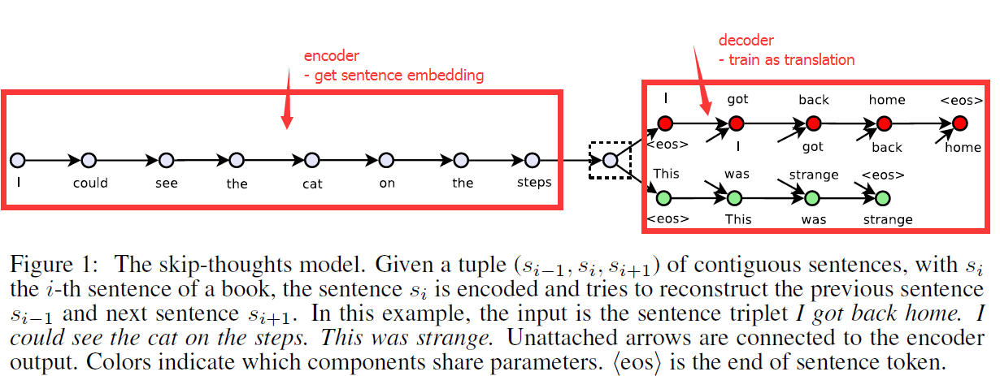

## Pairwise Sentence Model

### 2-ACL16-IBM-Addressing Limited Data for Textual Entailment Across Domains
  [PDF](https://arxiv.org/pdf/1606.02638v1.pdf), 
  [!Bib](~)
          
  - [**Problem-Paper**] exploit unlabled data to improve F-score for TE task. 
  - [**Problem-Experiment**] find all sentences in a corpus that entail a given hypothsis. 
  Domain: Newswire (RTE-5,6,7) & Clinical (self construct)
  - [**Model**] Tradition Features + self-training/activate learning
  - [**Conclusion**] The author analysis the possible explanation for the improvement:
  Class Distribution. down-sampling and up-sampling is not useful. 
  Activate learning will sampling positive examples, thus it can match the performance with fewer examples. 
  - [**Remark**] Experiment is beautiful and convising, Information Retrival Method.

　　This paper illustrates that how self-training will influence the classification and why active learning 
will reduce the examples to only 6 percent.   
　　The author experiments on two domains -- newswire and clinical. First, the author creates an entailment dataset 
for clinical domain with human annoted. Second, he builds a highly competitive supervised system, called ENT. Last, he
explore two strategies - self-training and active learning to address the lack of labled data. Experiment is done in 
detail and convincing.

### 6-NAACL16-Sultan-Bayesian Supervised Domain Adaptation for Short Text Similarity
  [PDF](http://www.aclweb.org/anthology/N/N16/N16-1107.pdf), 
  [Bib](http://www.aclweb.org/anthology/N/N16/N16-1107.bib)

  - [**Problem**] Domain Adaptation for Short Text Similarity
  - [**Model**]  A two-level hierachical Bayesian model -- Each $w_d$ depends not on its domain-specific observations
  (first level) but also on information derived from the global, shared parameter $w*$ (second level). And the 
  hierarchical structure (1) jointly learns global, task-level and domain-level feature weights, (2) retaining the 
  distinction between in-domain and out-of-domain annotations.
  - [**Features**]
    - monolingual word aligner
    - cosine similarity from 400-dimensional embedding(Baroni et.al, 2014)
  - [**Experiment**]
    - a). Short Text Similarity(STS), 10 domains
    - b). Short Answer Scoring(SAS), Dataset: Mohler et al., 2011
    - c). Answer Sentence Ranking(ASR), Dataset: Wang et al., 2007, TREC8-13
  - [**Remarks**]
    -     Although this is traditional feature method, and the results is not inspiring, the author construt **amount of 
    Analysis** to show the advantage of the system and answer why it does not perform well(**because of the data, smile**). 

### 9-AAAI16-Mueller-Siamese Recurrent Architectures for Learning Sentence Similarity
  [PDF](http://www.mit.edu/~jonasm/info/MuellerThyagarajan_AAAI16.pdf),
  Bib
 
  **A new top resluts for Relateness on SICK: 0.8822(pearson)**
  
  - [**Model**]
    - replace the top softmax layer with l1 norm similarity function
    - Sentence Representation can capature the following information:
      - negation, not, no
      - topic
      - Entailment classsification 
    - I think the model is to enforcement the similarity of the two sentences, which is direct and efficient.
  - [**Experiments TODO**]
    - replace the top layer
    - learn how to fine-grain the network.
    - Read this paper again.
    - Read the latest related paper from reference.

### 11-EMNLP15-Hua He-Multi-Perspective Sentence Similarity Modeling with Convolutional Neural Networks
  [PDF](http://aclweb.org/anthology/D/D15/D15-1181.pdf),
  [Bib](http://aclweb.org/anthology/D/D15/D15-1181.bib)

  **Multi-Perspective: 1). Multiple granularities 2). Window size 3). Multiple types of pooling 4). Similarity Measurement: Multiple distance functions**
  
  - [**Remarks**]:
    - This model tries to explore multi-perspective method on CNNs, so how to combine the local component I think is the key problem in the experiment, and the author proposed **building block** as a set of groups, which make the whole process clear and efficient.
  - [**Experiments TODO**]   
    - treat each **Perspective** as **Component** implemented in CNNs.
    - analysis different combination's efficient
    - add the thought of **Semantic Similarity** into the **Model**.

### 19-ACL16-IIIT-Together We Stand: Siamese Networks for Similar Question Retrieval
  [PDF](http://www.aclweb.org/anthology/P/P16/P16-1036.pdf),
  [Bib](http://www.aclweb.org/anthology/P/P16/P16-1036.bib)
  
  
  > Figure 2: Architecture of SCQA. The network consists of repeating convolution, max pooling and ReLU layers and a fully connected layer. Also the weights W1 to W5 are shared between the sub-networks.
  

  - [**Problem**]: Similar Question Retrieval, "lexico-syntactic gap"
  - [**Model**]: **Siamese Convolutional Neural Network for cQA (SCQA) learns th similarity metric for question-question pairs by leveraging the question-answer pairs available in cQA forum archives.** The idea is to project similar question pairs nearer to each other and dissimilar question pairs farther away from each other in the semantic space.(**Similar to TRANs in Reconmmendation System**).   
    However, questions pairs is not availabble, so this paper leverages existing question-anwer pairs. Input is word hashing, which is character level representation of documents that takes care of out-of-vocabulary(OOV)words and with minor spelling errors.   
    The SCQA is used to get question-question pair score, in addition, BM25 metrics was added into with weight  \alpha to improve the retrive performance.
  -  [**Experiments**]
    - Quantitative Analysis: Sevaral model compares.
    - Qualitative Analysis: Compare with each two model to analysis the effect of the model
  - [**Remark**]
    - The idea and model is simple, but the result is good and Qualitative Analysis is very meticulous

### 20-NAACL16-Hua He-PairwiseWord Interaction Modeling with Deep Neural Networks for Semantic Similarity Measurement
   [PDF](http://aclweb.org/anthology/N/N16/N16-1108.pdf),
   [Bib](http://aclweb.org/anthology/N/N16/N16-1108.bib)
   
   [20-SemEval16-Hua He-Attention-Based Multi-Perspective Convolutional Neural Networks for Textual Similarity Measurement](http://www.aclweb.org/anthology/S/S16/S16-1170.pdf)  
   [torch](https://github.com/hohoCode/textSimilarityConvNet)

    

   - [**Model**] 
     - [**Bi-LSTMs**] for context modeling of input sentences
     - [**Pairwise word interaction**] encourage direct comparisons between word contexts across sentences
     - [**Similarity focus layer**] help identify important pairwise word interactions
     - [**19-layer ConvNet**] converts the similarity measurement problem into similarity measurement
   - [**Experiment**]
   
    | Model                    | train    | trial    | test(r)     | settings
    |--------------------------|----------|----------|----------|---------
    | termfreq TF-IDF #w       | 0.479906 | 0.456354 | 0.478802 | ``freq_mode='tf'``
    | termfreq BM25 #w         | 0.476338 | 0.458441 | 0.474453 | (defaults)
    | ECNU run1                |          |          | 0.8414   | STS2014 winner
    | Kiros et al. (2015)      |          |          | 0.8655   | skip-thoughts
    | Mueller et al. (2016)    |          |          | 0.8822   | MaLSTM; state-of-art
    |--------------------------|----------|----------|----------|---------
  

    from https://github.com/brmson/dataset-sts/tree/master/data/sts/sick2014
    
    | Model                       | Pearson’s r    | Spearman’s p    | MSE      
    |-----------------------------|----------------|-----------------|----------
    | Socher et al. (2014) DTRNN  | 0.7863         | 0.7305          | 0.3983   
    | Socher et al. (2014) SDTRNN | 0.7886         | 0.7280          | 0.3859
    | Lai and Hockenmaier (2014)  | 0.7993         | 0.7538          | 0.3692
    | Jimenez et al. (2014)       | 0.8070         | 0.7489          | 0.3550
    | Bjerva et al. (2014)        | 0.8268         | 0.7721          | 0.3224
    | Zhao et al. (2014)          | 0.8414         | -               | -
    | LSTM                        | 0.8477         | 0.7921          | 0.2949
    | Bi-LSTM                     | 0.8522         | 0.7952          | 0.2850
    | 2-layer LSTM                | 0.8411         | 0.7849          | 0.2980
    | 2-layer Bi-LSTM             | 0.8488         | 0.7926          | 0.2893
    | Tai et al. (2015) Const. LSTM|0.8491         | 0.7873          | 0.2852
    | Tai et al. (2015) Dep. LSTM | 0.8676         | 0.8083          | 0.2532
    | He et al. (2015)            | 0.8686         | 0.8047          | 0.2606
    | He et al. (2016)            | 0.8784         | 0.8199          | 0.2329

   - [**Remark**]
     - from STS work to NAACL
     - old question, old model, new combination and high performance
     - **Since combine difference features will imporove the system performance, how to apply this strategy into Neural Networks**

### 10-NIPS15-Ryan-Skip-Thought Vectors
  [PDF](http://papers.nips.cc/paper/5950-skip-thought-vectors),
  [Bib](http://papers.nips.cc/paper/5950-skip-thought-vectors/bibtex),
  [Review](http://media.nips.cc/nipsbooks/nipspapers/paper_files/nips28/reviews/1826.html)
  [Theono](https://github.com/ryankiros/skip-thoughts)

  **This paper presented an encoder-decoder model to learn a generic, distributed sentence encoder.**
  
  - [**Problem**]: Sentence Representation. Sentence vectors ate extracted and evaluated with linear models on 8 tasks. 
  - [**Motivation**]: 
    > In this paper we abstract away from the composition methods themselves and consider an alternative loss function
    > that can be applied with any composition operator. **(step1 purpose: what we want to do?)** 
    > 
    > We consider the following question: is there a task and a corresponding loss that will allow us to learn highly 
    > generic sentence representations?  **(step2 question: The key problem?)** 
    >
    > We give evidence for this by proposing a model for learning high-quality sentence vectors without a particular
    > supervised task in mind. **(step3 plan1: solution we reject)** 
    > 
    > Using word vector learning as inspiration, we propose an objective function that abstracts the skip-gram model to 
    > the sentence level. That is, instead of using a word to predict its surrounding context, we instead encode a sentence
    > to predict the sentences around it. Thus, any composition operator can be substituted as a sentence encoder and 
    > only the objective function becomes modified.  **(step4 our work: step by step, more and more deep)** 
    > 
    > Figure 1 illustrate the model. We call our model **skip-thoughts** and vectors induced by our model are called
    > **skip-thought vectors**. **(step5 Others: Figure or Name)** 

       